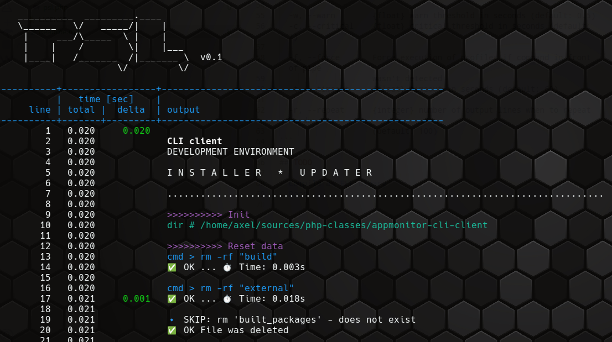

# Axels Profiler for STDOUT

CLI app for profiling output from commandline tools.
It shows the delta time that it takes to produce each line.

This is free software.

Author: Axel Hahn \
Source: <https://github.com/axelhahn/php-psl> \
License: GNU GPL 3 \
Docs: TODO

## Requirements

- PHP 8.x
- Linux

## Usage

```txt
<your-command> | ./src/psl.php [options]
```

```txt
    __________  _________.____     
    \______   \/   _____/|    |    
     |     ___/\_____  \ |    |    
     |    |    /        \|    |___ 
     |____|   /_______  /|_______ \  v0.1
                      \/         \/


    PROFILER FOR STDOUT LINES


This profiler listens to STDOUT and writes needed times for each line.
You can measure the time it takes to process each line and can finde bottlenecks.
Start your command and behind a pipe sign put the profiler.

This is free software.

Author: Axel Hahn
License: GNU GPL 3
Source: https://github.com/axelhahn/php-psl
Docs: TODO


SYNTAX:
  <your-command> | psl [options]


OPTIONS:
  -h, --help        show this help text

  -w, --warn        {float} warn threshold in seconds (default: 0.5)
  -c, --critical    {float} critical threshold in seconds (default: 2)

  -f, --force       Force execution of profiler if command in front of pipe 
                    wasn't detected
  -t, --timeout     {float} timeout in seconds (default: 60)

  -r, --repeat      {integer} number of output lines when to repeat header
                    (default: 100)
```

## Screenshot



## TODO

- Compile as ELF binary
- Docs
